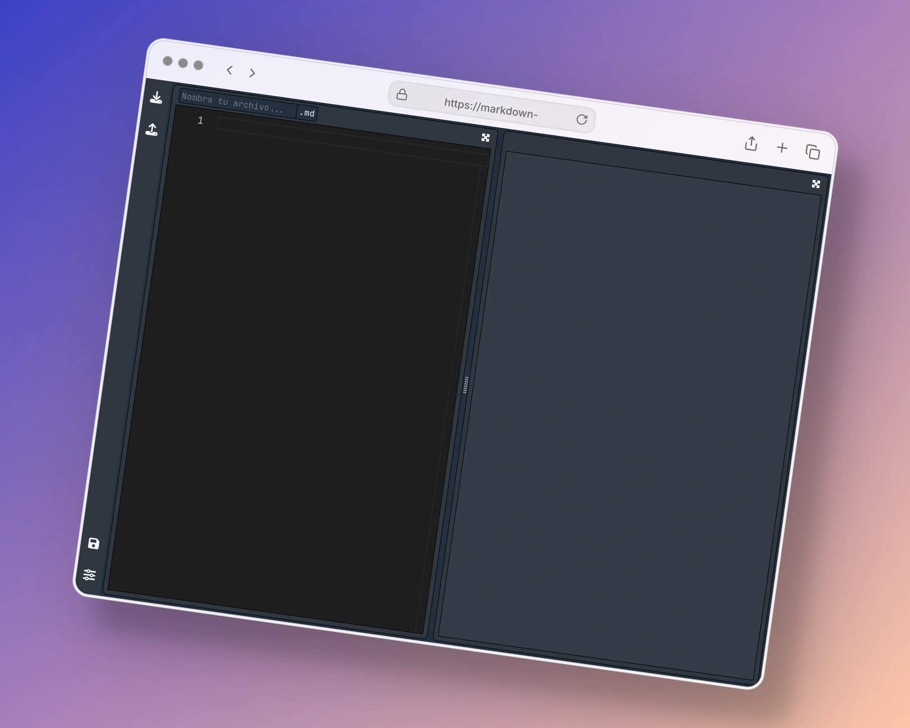

# **_Markdown Editor_**

## Preview



## **Tecnologias utilizadas en el proyecto**

- [React](https://reactjs.org/)
- [Vite](https://vitejs.dev/)
- [Redux y React-Redux](https://redux.js.org/)
- [Sass](https://sass-lang.com/)
- [ReactStrap](https://reactstrap.github.io/?path=/docs/home-installation--page)
- [React Split](https://split.js.org/)

## **Como iniciar proyecto**

Instalar dependencias del proyecto
```
npm install
```

Iniciar servidor web
```
npm run dev
```
